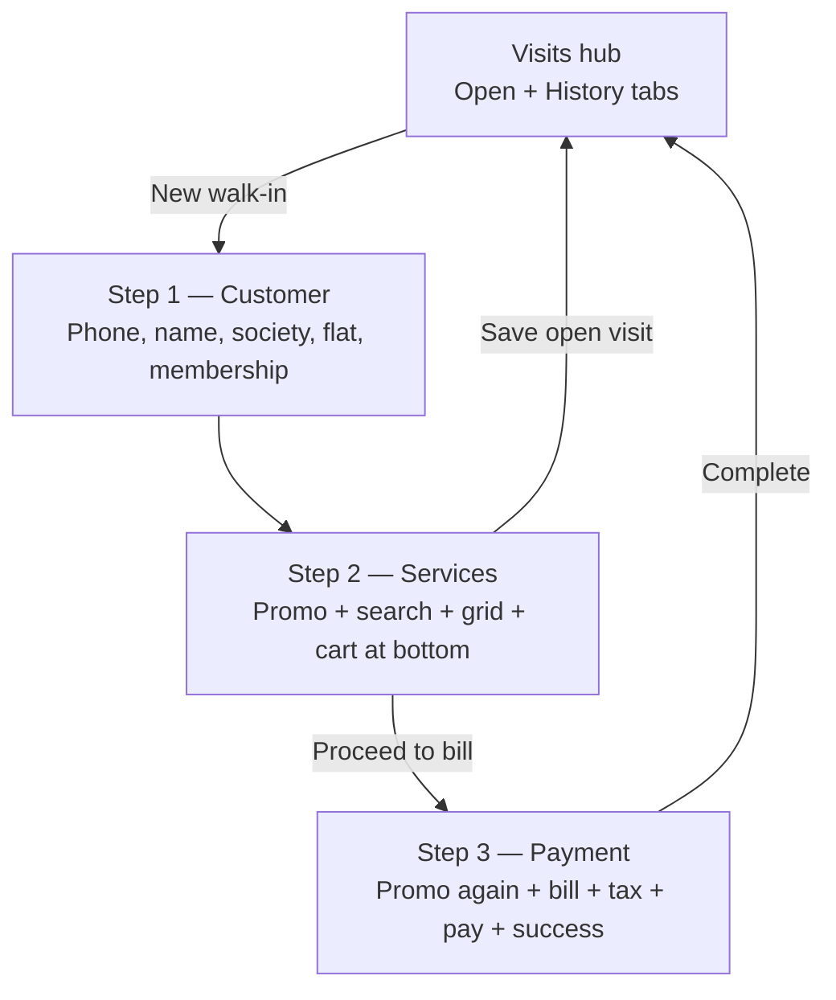
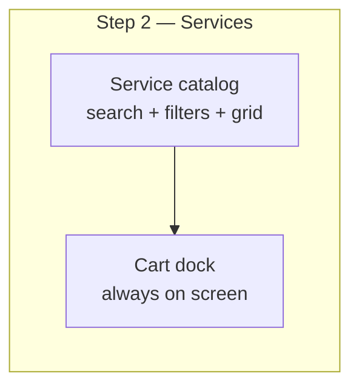

# Walk-in booking UX proposal

**Status:** Implemented — pending local QA (do not deploy until sign-off confirmed)  
**Scope:** Manager walk-in flow — `/manager/walk-in`  
**Date:** 2026-08-08  
**Author:** Antrahq engineering review

---

## Executive summary

The current walk-in flow is functionally complete but **not POS-native**. On service selection (Step 2), the cart lives **below** a long stack of promo controls and a scrollable service grid (~189 services at Lithos). Managers must scroll to see the cart, assign stylists, and proceed — especially painful on mobile.

This proposal restructures Step 2 around a **persistent cart dock** (mobile bottom bar + desktop side panel), moves discounts to the payment step only, and reduces visual noise so each screen has **one primary job**.

---

## Current flow (as built today)



### Step 2 layout today (problem)

```
┌─────────────────────────────────────┐
│ Wizard + Mission strip + errors     │
├─────────────────────────────────────┤
│ Membership banner (if member)         │
├─────────────────────────────────────┤
│ COUPON / OFFER / MANUAL DISCOUNT    │  ← rarely needed while picking services
│ (full card, 2 selects + inputs)     │
├─────────────────────────────────────┤
│ Search + recent + favorites + cats  │
│ ┌─────┬─────┬─────┬─────┐           │
│ │ Svc │ Svc │ Svc │ Svc │  scroll   │  ← catalog scrolls inside fixed height
│ └─────┴─────┴─────┴─────┘           │
├─────────────────────────────────────┤
│ CART (3) — est. total               │  ← user must scroll here
│ • Service + stylist dropdown        │
│ • Service + stylist dropdown        │
│ [Save open] [Proceed to bill]       │
└─────────────────────────────────────┘
```

### Pain points (mapped to your feedback)

| Issue | Root cause in code |
|--------|-------------------|
| Cart not visible while picking services | Cart is a separate `Card` **after** promo block + service grid in document order |
| Not mobile-friendly | Single column stack; cart `sticky` offset fights safe-area; tall cart with per-line stylist selects |
| Too many details per screen | Step 2 = promo + catalog + cart; Step 3 **repeats** promo + full tax UI |
| Confusing steps | 3 steps but Step 2 does 3 jobs; two equal CTAs (“Save open” vs “Proceed to bill”) |
| Desktop screenshot issue | 4-column grid + cart below fold for large catalogs |

---

## Proposed UX (recommended)

### Design principles

1. **One primary action per screen** — pick services OR pay, not both mixed with discounts.
2. **Cart always visible** when it has items (collapsed bar minimum).
3. **Progressive disclosure** — promos, tax overrides, optional customer fields hidden until needed.
4. **Mobile-first, desktop-enhanced** — same flow; desktop gets a side cart panel.

### Proposed flow (unchanged step count, clearer jobs)

| Step | Job | What manager sees |
|------|-----|-------------------|
| **1 — Customer** | Identify guest | Phone (required), name (required), optional address collapsed |
| **2 — Services** | Build the visit | Catalog + **persistent cart dock** only |
| **3 — Bill & pay** | Close the sale | Total hero, adjustments, payment, receipt |



---

## Detailed changes by screen

### A. Hub (Visits) — minor tweaks

- **Keep** Open / History tabs and draft restore.
- **Remove** `MissionStrip` from the **flow** screens only (keep on hub) — reduces vertical clutter mid-booking.

**Sign-off:** ☐ Approve ☐ Skip

---

### B. Step 1 — Customer (simplify)

**Keep**
- Recent customer chips (horizontal scroll)
- Phone lookup + membership badge
- “Continue to services” primary CTA

**Change**
- Collapse **Society / Flat** into “Add address (optional)” `<details>` — most walk-ins skip this.
- Show compact **customer summary chip** at top of Step 2 (name · phone · Edit) instead of re-reading wizard context.

**Sign-off:** ☐ Approve ☐ Skip

---

### C. Step 2 — Services (main redesign)

#### C1. Remove promo block from Step 2

Move **coupon, offer, and manual discount** entirely to Step 3.  
Rationale: managers pick services first; discounts apply at billing (matches salon floor mental model).

**Sign-off:** ☐ Approve ☐ Skip

#### C2. Persistent cart dock

**Mobile (< md)**

```
┌──────────────────────────────┐
│  [Customer chip]  Step 2/3   │
│  Search · filters · grid     │
│  (fills viewport minus dock) │
├──────────────────────────────┤
│ 🛒 3 services · ₹1,943  [▲] │  ← fixed bottom bar (always visible)
│ [Proceed to bill]            │  ← primary; disabled until stylists set
└──────────────────────────────┘
```

- Tap bar or `[▲]` opens **bottom sheet** with:
  - Line items (name, price, remove)
  - Stylist per line OR **“Same stylist for all”** toggle (new)
  - Variable price extra input (when needed)
  - Secondary: “Save & keep open”

**Desktop (≥ md)**

```
┌────────────────────┬───────────────┐
│ Service catalog    │ Cart panel    │
│ (60–65% width)     │ (sticky 35%)  │
│                    │ lines + staff │
│                    │ total + CTAs  │
└────────────────────┴───────────────┘
```

**Sign-off:** ☐ Approve ☐ Skip

#### C3. Catalog layout

- Mobile: **1 column** service cards (full width, easier tap targets)
- Tablet: 2 columns
- Desktop: 3 columns in catalog pane (not 4 — reduces card height)
- Catalog uses **`calc(100dvh - header - stepper - cartDock)`** height — no nested max-height scroll fighting page scroll

**Sign-off:** ☐ Approve ☐ Skip

#### C4. Add-to-cart feedback

- Brief toast: “Added · Beard Trimming + Styling”
- Cart dock animates count + total (micro-interaction)

**Sign-off:** ☐ Approve ☐ Skip

#### C5. Stylist assignment UX

- Default: auto-assign preferred staff (already in code) — show chip “Priya (auto)” with one-tap change
- Bottom sheet: **“Apply same stylist to all”** dropdown at top
- Block “Proceed to bill” until all lines have staff (keep validation, clearer inline message on dock)

**Sign-off:** ☐ Approve ☐ Skip

---

### D. Step 3 — Bill & pay (simplify)

**Layout order (top → bottom)**

1. **Grand total hero** — large ₹ amount, customer name
2. **Service summary** — collapsed list (expand to edit → returns to Step 2)
3. **Adjustments** (collapsible section, open if coupon pre-applied)
   - Coupon / offer / manager discount (moved from Step 2)
4. **Tax breakdown** — subtotal, discounts, CGST/SGST; “Advanced tax override” stays in `<details>`
5. **Payment** — mode segmented control + reference / split rows
6. **Sticky bottom:** “Complete & generate invoice”

**Remove duplication**
- No second full promo card above the bill if already in Adjustments section

**Sign-off:** ☐ Approve ☐ Skip

---

### E. Step indicator

**Mobile:** Compact 3-dot stepper with labels under current step only  
**Desktop:** Keep existing `WizardSteps` with click-back where allowed

**Sign-off:** ☐ Approve ☐ Skip

---

## What we are NOT changing (unless you ask)

- Backend APIs, billing logic, GST calculation
- Open visit / draft persistence behavior
- Membership auto-apply rules
- History tab / floor schedule links
- Invoice PDF + review invite after payment

---

## Implementation plan (after sign-off)

| Phase | Work | Est. effort |
|-------|------|-------------|
| **P0** | Cart dock + bottom sheet (mobile), side panel (desktop); remove Step 2 promo | 1–2 days |
| **P1** | Step 3 re-layout; move discounts; sticky pay bar | 0.5–1 day |
| **P2** | Step 1 optional fields collapse; customer chip; toasts; same-stylist | 0.5 day |
| **P3** | Polish, i18n keys, manager walk-in QA on iPhone + iPad + desktop | 0.5 day |

**Local review:** `npm run dev` → `/manager/walk-in?new=1`  
**Test branch:** Mantri Lithos manager (large catalog)

---

## Acceptance criteria (for your sign-off)

- [ ] On iPhone 12, manager can add 3+ services **without scrolling** to find cart total
- [ ] Cart item count and estimated total **always visible** when cart non-empty
- [ ] Stylist assignment doable from cart sheet without losing place in catalog
- [ ] Step 2 has **no** coupon/offer/manual discount UI
- [ ] Step 3 shows discounts in one collapsible “Adjustments” section
- [ ] Desktop: cart visible beside catalog while scrolling services (no scroll-to-bottom)
- [ ] Existing flows still work: save open visit, resume draft, bill now from hub, split payment

---

## Alternatives considered

| Option | Pros | Cons | Recommendation |
|--------|------|------|----------------|
| **2-step flow** (merge customer + services) | Fewer taps | Longer first screen | Defer — bigger change |
| **Floating mini-cart only** (no sheet) | Faster to build | Stylist assign still cramped | Insufficient alone |
| **Full-screen cart step** between 2 and 3 | Clear separation | Extra tap every visit | Rejected |
| **This proposal** (dock + move promos) | POS-native, minimal API change | Moderate UI refactor | **Recommended** |

---

## Sign-off

| Reviewer | Decision | Date | Notes |
|----------|----------|------|-------|
| | ☐ Approved as proposed | | |
| | ☐ Approved with changes | | |
| | ☐ Rejected — revise | | |

**Changes requested (if any):**

```
(free text)
```

---

## Next step

Once you approve (or note changes above), implementation will happen on a branch for **local review only**. Production deploy will wait for your explicit go-ahead after you test on device.
